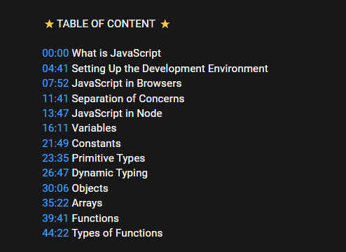
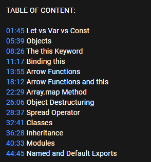
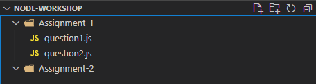

# Reference Links &  [Assignment](#assignment)

## GitHub

- Article for push-pull & clone
    - [medium.com/@mehulgala77/github-fundamentals-clone-fetch-push-pull-fork-16d79bb16b79](https://medium.com/@mehulgala77/github-fundamentals-clone-fetch-push-pull-fork-16d79bb16b79)
    - [docs.github.com/en/get-started](https://docs.github.com/en/get-started)
- Video for the same & an extensive video for the full tutorial
    - [youtube.com/watch?v=HkdAHXoRtos&ab_channel=Fireship](https://www.youtube.com/watch?v=HkdAHXoRtos&ab_channel=Fireship)
    - [youtube.com/watch?v=8JJ101D3knE](https://www.youtube.com/watch?v=8JJ101D3knE)

## JavaScript

### Documentation site

- [developer.mozilla.org/en-US/docs/Web/JavaScript](https://developer.mozilla.org/en-US/docs/Web/JavaScript)

### Classic JavaScript Refresh

- Mosh's video of basic JavaScript - [youtube.com/watch?v=W6NZfCO5SIk](https://www.youtube.com/watch?v=W6NZfCO5SIk) 

    


### Modern JavaScript

- [youtube.com/watch?v=NCwa_xi0Uuc](https://www.youtube.com/watch?v=NCwa_xi0Uuc)

    

## Node

### Documentation site

- [nodejs.org/en/docs/](https://nodejs.org/en/docs/)

### Node.js Introduction and Installation

- Architecture - [youtube.com/watch?v=XUSHH0E-7zk](https://www.youtube.com/watch?v=XUSHH0E-7zk)
- How Node.js Works - [youtube.com/watch?v=jOupHNvDIq8](https://www.youtube.com/watch?v=jOupHNvDIq8)
- Installation - [youtube.com/watch?v=qZQmCfkmbNA](https://www.youtube.com/watch?v=qZQmCfkmbNA)


# Assignment

- Implement Given Problem with Node.js [leetcode.com/problems/two-sum/](https://www.leetcode.com/problems/two-sum/)
- Upload the code in your GitHub Repository
- Share the repository link with Coordinators. [forms.gle/uwaKYLb5kEoDh5BE9](https://forms.gle/uwaKYLb5kEoDh5BE9)

### Question1.js
**Implement the following function which should return as mentioned above**
```js
const twoSum = (nums, target) => {
    
};
console.log(twoSum([2,7,11,15], 9))  //Output : [0,1]
```

**Things to be taken care of**

- Make sure your GitHub repository is public
- Name your repository according to the given format
    NodeJSWorkshop-{college-name}-{branch-name}-{semester}-{your-name}
- You need to separate assignments folder wise
    - For example, "Your Repository/Assignment-1"

    


### Question 2

 **What's the difference between map and object in JS.**

- Try to find the answer to the question. We will discuss this in the next session!
    
    For Reference, Map and Set in JavaScript - [youtube.com/watch?v=hLgUTM3FOII](https://www.youtube.com/watch?v=hLgUTM3FOII)